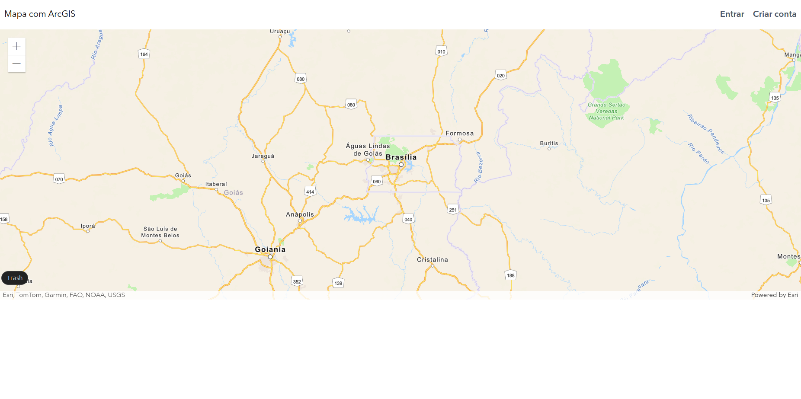
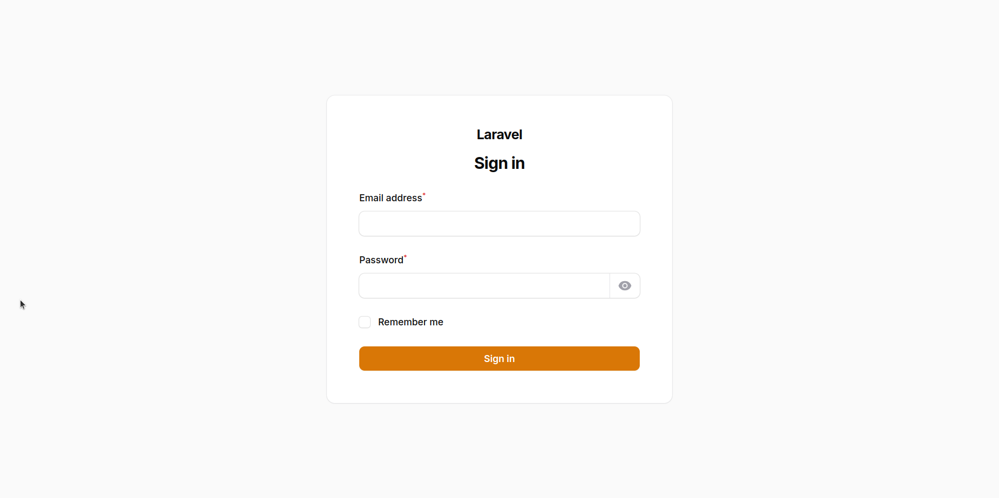
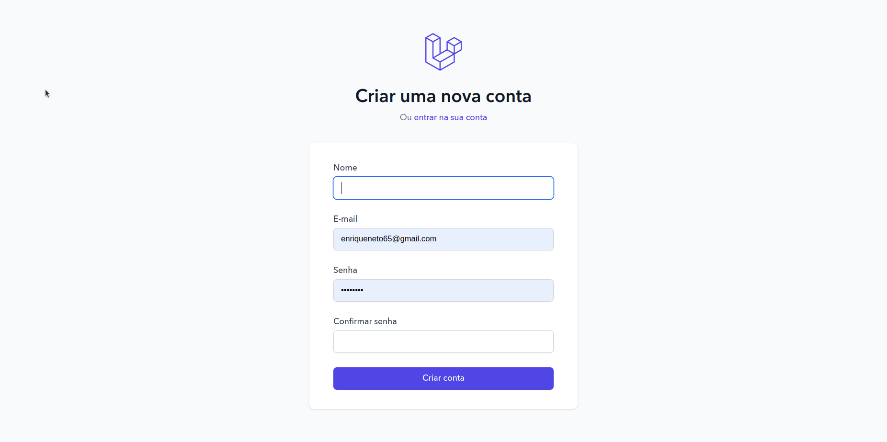
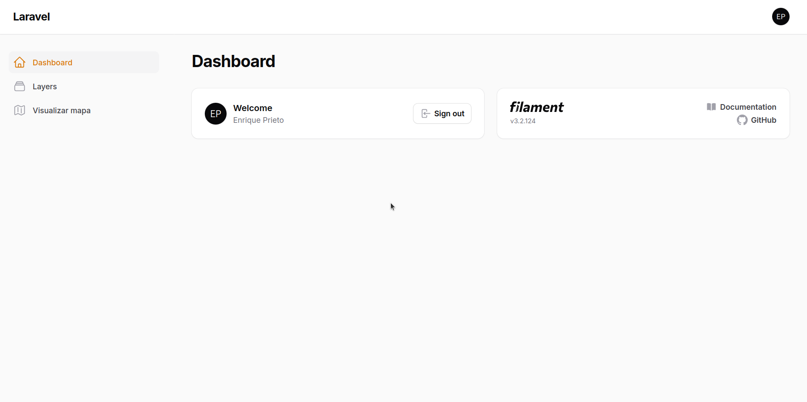
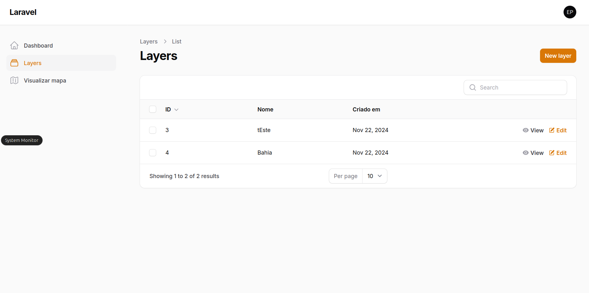
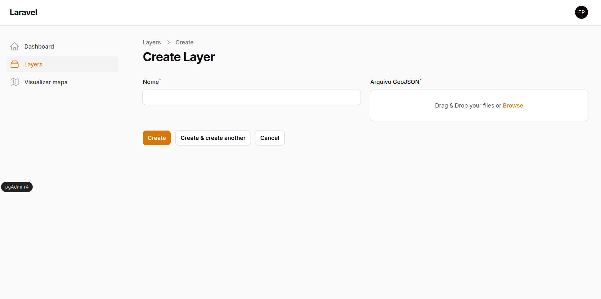
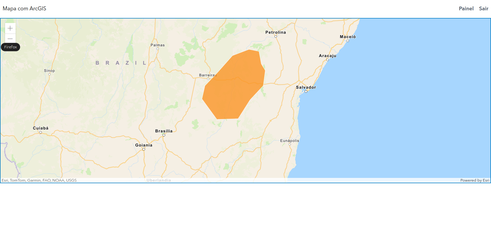

# Desafio Técnico: Desenvolvedor Full Stack

Este repositório foi criado para um desafio técnico para a vaga de **Desenvolvedor Full Stack**. Com o objetivo de mostrar minhas habilidades em desenvolvimento web.

O desafio é criar um sistema web com foco em gestão de dados georreferenciados e exibição em mapa.

## Dependências

Antes de irmos para a instalação do projeto, precisamos fazer algumas verificações antes. Existem algumas ferramentas que são necessárias estarem instaladas para o funcionamento correto do projeto, são eles:

- Git => `2.43.0`
- Docker => `2.30.3`
- Docker Compose => `2.30.3`
- PHP => `8.3.6`
- Composer => `2.8.3`
- `php-pgsql`
- Node => `18.20.4`
- Laravel => `11.31`
- TallStack => `8.0`
- Filementphp => `3.2`
- PostgreSQL => `14`
- PostGIS => `3.2.0`

## Rodando o projeto

Neste projeto você consegue rodar-lo de 2(duas) formas diferente: automatizado e manual. Irei mostrar e explicar cada uma.

[Vídeo explicando como rodar o projeto](https://www.loom.com/share/eebf0f805f954b0b9c78d2dfb9793a9a?sid=453a028e-fbca-4fb5-8c40-90da26ab3fe0)

### Automatizado

Para tornar a experiência de desenvolvimento mais leve, criei um arquivo chamado `start-app.sh` que se encontra na raíz deste repositório. Basta executar o seguinte comando:

```bash
sh start-app.sh
```

Com esse `script` ele vai subir o banco de dados, configurar o projeto, instalar as dependências e inicializar o servidor da aplicação. Se ocorrer tudo certo com a execução do script você poderá acessar a aplicação pela URL: [http://localhost:8000](http://localhost:8000). Caso tenha dado algum erro na execução do **script**, confirme se as dependências do projeto estão instaladas corretamente e tente novamente.

Caso você esteja usando um sistema **Windows** será preciso instalar ferramentas que permitam executar um script `bash`, como por exemplo

- Git Bash
- WSL

Mas caso queria rodar o projeto de forma manual, siga os passos abaixo

### Manual

#### Variável de ambiente

Caso tenha acabado de baixar o projeto, o arquivo `.env` não estará presente no projeto. Este arquivo é crucial para funcionamento da aplicação. Copie o arquivo `.env.example` ou rode o seguinte comando:

```bash
cp .env.example .env
```

Após criar o `.env` vamos precisar gerar uma `APP_KEY` para nosso projeto, então, execute o seguinte comando:

```bash
php artisan key:generate
```

Esse comando irá gerar nosso `APP_KEY` e atualizar nosso `.env`. Agora com essas configurações finalizadas, podemos começar a inicializar o projeto.

#### Inicializando o banco de dados

Pelo terminal acesse o diretório que está presente o código deste repositório e rode o seguinte comando:

```bash
docker-compose up -d --build
```

Com esse comando ele vai subir nosso banco de dados `PostgreSQL` junto com a extensão `PostGIS`. Para garantir que nosso banco esteja com todas alterações criadas nas migrations, rode o comando

```bash
php artisan migrate
```

Esse comando irá sincronizar o banco de dados e criar as tabelas necessárias no banco de dados.

#### Instalando as dependências

Para instalar as dependências do laravel, rode o seguinte comando:

```bash
composer install && npm install
```

Com esse comando será instalado as dependências do `composer` e `npm`.


#### Inicialiar aplicações

Após seguir os passos acima, vamos rodar os comandos que irão inicializar o projeto.

```bash
php artisan serve & npm run dev
```

Se ocorrer tudo certo com a execução do comando você poderá acessar a aplicação pela URL: [http://localhost:8000](http://localhost:8000).


## Features

[Video apresentando o sitema e painel](https://www.loom.com/share/4c8e253d54744edf8c8a435da600e30c?sid=76c05e7f-af4c-46a5-ac98-a56f9fdb66ee)

### Página inicial

Na página inicial será exibido uma tela parecida com o screenshot abaixo:



Caso você esteja já logado será exibido links para acessar o painel e sair da conta. Mas caso você esteja deslogado, será exibido links de **"Entrar"** e **"Criar conta"**

### Login



### Criar conta



### Painel



### Layers



[Video apresentando as layers](https://www.loom.com/share/695726e953b84aedb5b78134e3762a05?sid=8427e26f-f5ad-4637-ad81-a2d25acd7d95)

#### Criar layer

Para criar uma nova layer, clique em "New layer"



Será preciso informar o nome da layer e um GeoJSON. Segue abaixo um exemplo de GeoJSON:

```json
{
  "type": "FeatureCollection",
  "features": [
    {
      "type": "Feature",
      "geometry": {
        "type": "Polygon",
        "coordinates": [
          [
            [-44.4131, -14.7802],
            [-42.9998, -14.7393],
            [-42.1993, -13.5077],
            [-41.3246, -12.6014],
            [-41.1889, -11.6075],
            [-41.4676, -11.1876],
            [-41.6242, -10.3657],
            [-42.2799, -10.2355],
            [-43.3638, -10.6391],
            [-44.3534, -11.7463],
            [-45.1892, -12.5957],
            [-45.3965, -13.4536],
            [-44.4131, -14.7802]
          ]
        ]
      },
      "properties": {
        "name": "Estado da Bahia"
      }
    }
  ]
}

```

Após cadastrar, podemos ir para a página inicial. Clicando no link "Visualizar Mapa" será exibido os polygonal no mapa. Segue um exemplo no screenshot abaixo:


